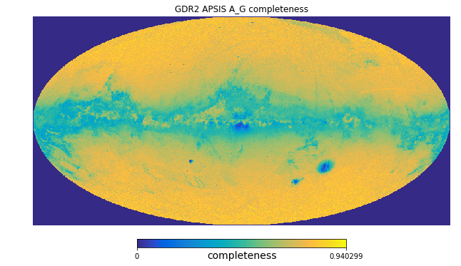
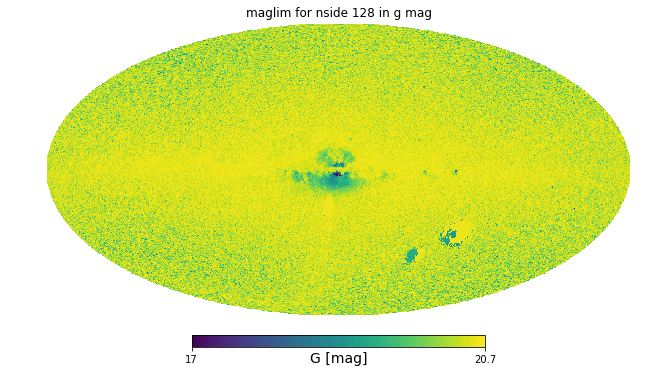
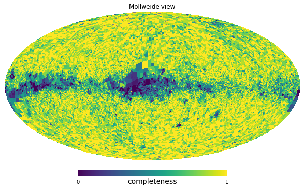

# gdr2_completeness
This package helps with

[1] querying GaiaDR2 TAP services in chunks of healpixel

[2] assembling approximate completeness maps per healpixel and G magnitude bin



For example for GaiaDR2 extinction extimates were delivered down to G=17. This is an all-sky map in Galactic coordinates showing the completeness of all sources with extinction estimate compared to all sources down to 17th Gmag.

## update in version 1.0 

[3] Downloading data to assess the magnitude limits per healpix

[4] Calculating the magnitude limits of Gaia per healpix for different bands



The all-sky G magnitude limit of GaiaDR2 sources that have BP and RP color. These maps are saved in 'data/maglim_X_in_nside128.npy' for G, BP and RP magnitude limits for healpix level 7 ordered by healpix. Or you can generate them yourself with notebook [3] and [4].

## update in version 2.0

[5] Querying the GDR2 RVS selection function

[6] Estimating the average number of sources from the second telescope



The all-sky completeness of the GDR2_RVS sample with respect to all sources in GDR2 for G = 12.5 mag and GRP = 12.0 mag (corresponding to GRVS = 11.8 mag) as returned by our python function.

## Getting started
The jupyter [tutorial](https://github.com/jan-rybizki/gdr2_completeness/tree/master/tutorials) illustrates the basic usage of this software. It can be inspected in the github repository or you can run it interactively on your local machine.


## Installation

```
pip install git+https://github.com/jan-rybizki/gdr2_completeness.git
```
it has a few dependencies (healpy, pyvo) and was only tested using python 3


## Authors
- Jan Rybizki (MPIA, rybizki@mpia.de)

## Collaborators
- Ronald Drimmel (INAF)
- Josep Manel Carrasco (University of Barcelona)

## Attribution
If you use sofwares in the example tutorials [1] & [2] (first release) please cite [ASCL-cite](https://ascl.net/code/v/1981).
If you use software in the example tutorials [3] & [4] (v1.0) please cite [GeDR3mock paper](https://ui.adsabs.harvard.edu/abs/2020PASP..132g4501R/abstract).
If you use software in the example tutorials [5] & [6] (v2.0) please cite [GDR2 selection function](https://arxiv.org/abs/2008.09096).


## License
The package is licensed under the Creative Commons [Attribution-ShareAlike 4.0 International](https://creativecommons.org/licenses/by-sa/4.0/).
